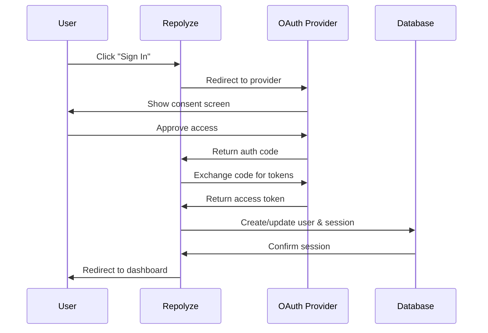

## Overview

Repolyze uses **NextAuth.js** with OAuth providers to securely authenticate users. No passwords are stored—authentication is handled by trusted third-party providers.

<Info>
  Authentication unlocks higher daily analysis limits, export features, and Pro-tier capabilities like AI Insights and Data Flow diagrams.
</Info>

## Supported Providers

Repolyze supports two OAuth providers for seamless sign-in:

### GitHub OAuth

<Card title="Sign in with GitHub" icon="github">
  Authenticate using your GitHub account. Perfect for developers who want to analyze repositories and create issues directly.
</Card>

**Why GitHub?**
- Integrates with GitHub issue creation
- Familiar to developers
- Single sign-on for developer tools

### Google OAuth

<Card title="Sign in with Google" icon="google">
  Authenticate using your Google account. Ideal for users who prefer Google's authentication system.
</Card>

**Why Google?**
- Wide adoption across platforms
- Secure OAuth 2.0 implementation
- Easy access from any device

<Note>
  Both providers offer the same features and rate limits. Choose whichever you prefer!
</Note>

## How Authentication Works

Repolyze implements a **database-backed session strategy** for security and reliability:

### Authentication Flow



### Technical Implementation

Repolyze uses **NextAuth.js v5** with the Prisma adapter:

<CodeGroup>
```typescript lib/auth.ts
import NextAuth from "next-auth";
import GitHub from "next-auth/providers/github";
import Google from "next-auth/providers/google";
import { PrismaAdapter } from "@auth/prisma-adapter";
import { prisma } from "@/lib/prisma";

export const { handlers, auth, signIn, signOut } = NextAuth({
  trustHost: true,
  adapter: PrismaAdapter(prisma),
  providers: [
    GitHub({
      clientId: process.env.AUTH_GITHUB_ID,
      clientSecret: process.env.AUTH_GITHUB_SECRET,
    }),
    Google({
      clientId: process.env.AUTH_GOOGLE_ID,
      clientSecret: process.env.AUTH_GOOGLE_SECRET,
    }),
  ],
  pages: {
    signIn: "/login",
  },
  session: {
    strategy: "database",
  },
  callbacks: {
    async session({ session, user }) {
      if (session.user) {
        session.user.id = user.id;
      }
      return session;
    },
  },
});
```

```prisma prisma/schema.prisma
model User {
  id            String    @id @default(cuid())
  name          String?
  email         String?   @unique
  emailVerified DateTime?
  image         String?
  accounts      Account[]
  sessions      Session[]
  createdAt     DateTime  @default(now())
  updatedAt     DateTime  @updatedAt

  // Subscription fields
  plan              String    @default("free") // "free" | "pro"
  polarCustomerId   String?   @unique
  polarSubscriptionId String?
  planExpiresAt     DateTime?
}

model Account {
  id                String  @id @default(cuid())
  userId            String
  type              String
  provider          String  // "github" | "google"
  providerAccountId String
  refresh_token     String? @db.Text
  access_token      String? @db.Text
  expires_at        Int?
  token_type        String?
  scope             String?
  id_token          String? @db.Text
  session_state     String?

  user User @relation(fields: [userId], references: [id], onDelete: Cascade)

  @@unique([provider, providerAccountId])
}

model Session {
  id           String   @id @default(cuid())
  sessionToken String   @unique
  userId       String
  expires      DateTime
  user         User     @relation(fields: [userId], references: [id], onDelete: Cascade)
}
```
</CodeGroup>

## Session Management

### Database-Backed Sessions

Repolyze stores sessions in PostgreSQL for security and persistence:

- **Session Token**: Unique identifier stored in a secure HTTP-only cookie
- **Expiration**: Sessions expire after 30 days of inactivity
- **User ID**: Links session to user account for plan and rate limit checks

<Warning>
  Sessions are server-side only. The client receives an encrypted session token but never has direct access to user data.
</Warning>

### Checking Authentication Status

In API routes and server components:

```typescript
import { auth } from "@/lib/auth";

export async function GET() {
  const session = await auth();
  
  if (!session?.user?.id) {
    return Response.json({ error: "Unauthorized" }, { status: 401 });
  }
  
  // User is authenticated
  const userId = session.user.id;
  // ...
}
```

## Account Lifecycle

### First Sign-In

When you sign in for the first time:

1. **OAuth Consent**: Approve access from GitHub/Google
2. **Account Creation**: Repolyze creates a `User` record in the database
3. **Plan Assignment**: You're assigned the **Free** plan by default
4. **Session Created**: A session is generated and stored
5. **Redirect**: You're redirected to the dashboard

<Info>
  Your email address is stored for subscription management but is never shared with third parties.
</Info>

### Subsequent Sign-Ins

Returning users:

1. **OAuth Verification**: Verify identity with provider
2. **Session Lookup**: Check for existing account
3. **Session Refresh**: Create new session token
4. **Plan Check**: Verify current plan and expiration
5. **Redirect**: Return to dashboard

### Account Deletion

To delete your account:

1. Sign in to your Repolyze account
2. Navigate to **Settings** → **Account**
3. Click **Delete Account**
4. Confirm deletion

<Warning>
  Deleting your account is **permanent** and will:
  - Remove all analysis history
  - Cancel any active Pro subscription
  - Invalidate all sessions
  - Delete all personal data from our database
</Warning>

## Security Features

### Data Protection

- **OAuth Only**: No passwords stored on Repolyze servers
- **Encrypted Tokens**: All tokens are encrypted at rest
- **HTTPS Required**: All authentication flows use TLS 1.3
- **CSRF Protection**: Built-in CSRF token validation
- **Session Expiration**: Automatic cleanup of expired sessions

### Provider Permissions

Repolyze requests minimal permissions:

| Provider | Scope | Purpose |
|----------|-------|----------|
| GitHub | `user:email` | Get email address for account creation |
| GitHub | `read:user` | Get profile name and avatar |
| Google | `openid email profile` | Get email, name, and avatar |

<Note>
  Repolyze **never** requests access to your repositories or private data. We only need basic profile information.
</Note>

## Environment Variables

For self-hosting or development, configure these OAuth credentials:

```bash .env.example
# NextAuth
AUTH_SECRET=your-auth-secret-here  # Generate with: npx auth secret

# GitHub OAuth (https://github.com/settings/developers)
AUTH_GITHUB_ID=your-github-oauth-client-id
AUTH_GITHUB_SECRET=your-github-oauth-client-secret

# Google OAuth (https://console.cloud.google.com/apis/credentials)
AUTH_GOOGLE_ID=your-google-client-id
AUTH_GOOGLE_SECRET=your-google-client-secret
```

<Info>
  See [Development Guide](/development) for detailed setup instructions.
</Info>

## Troubleshooting

<AccordionGroup>
  <Accordion title="Error: 'Missing GitHub OAuth environment variables'">
    This error occurs when `AUTH_GITHUB_ID` or `AUTH_GITHUB_SECRET` are not set in your `.env` file. 
    
    **Solution**: Create a GitHub OAuth app and add credentials to `.env`.
  </Accordion>

  <Accordion title="Error: 'Missing Google OAuth environment variables'">
    This error occurs when `AUTH_GOOGLE_ID` or `AUTH_GOOGLE_SECRET` are not set.
    
    **Solution**: Create a Google OAuth client and add credentials to `.env`.
  </Accordion>

  <Accordion title="Why was I signed out?">
    Sessions expire after 30 days of inactivity. You'll need to sign in again.
  </Accordion>

  <Accordion title="Can I link multiple providers to one account?">
    Not currently. Each provider creates a separate account. This may change in future updates.
  </Accordion>

  <Accordion title="Is my data secure?">
    Yes. Repolyze uses industry-standard OAuth 2.0, encrypts all tokens, and stores sessions securely in PostgreSQL. We never store passwords.
  </Accordion>
</AccordionGroup>

## API Reference

### Authentication Endpoints

| Endpoint | Method | Description |
|----------|--------|-------------|
| `/api/auth/signin` | GET | Redirect to OAuth provider |
| `/api/auth/callback/:provider` | GET | OAuth callback handler |
| `/api/auth/signout` | POST | Sign out and invalidate session |
| `/api/auth/session` | GET | Get current session |

### Usage in Code

```typescript
import { auth, signIn, signOut } from "@/lib/auth";

// Check authentication
const session = await auth();

// Sign in
await signIn("github");

// Sign out
await signOut();
```

## Next Steps

<CardGroup cols={2}>
  <Card title="Plans & Pricing" icon="tag" href="/account/plans-pricing">
    Upgrade to Pro for higher limits
  </Card>
  <Card title="Rate Limits" icon="gauge" href="/account/rate-limits">
    Understand daily analysis quotas
  </Card>
</CardGroup>