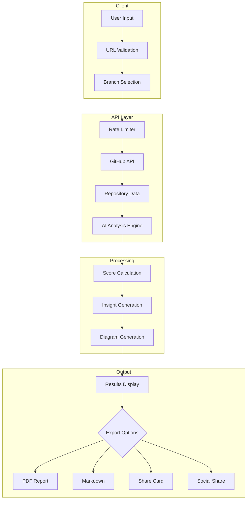
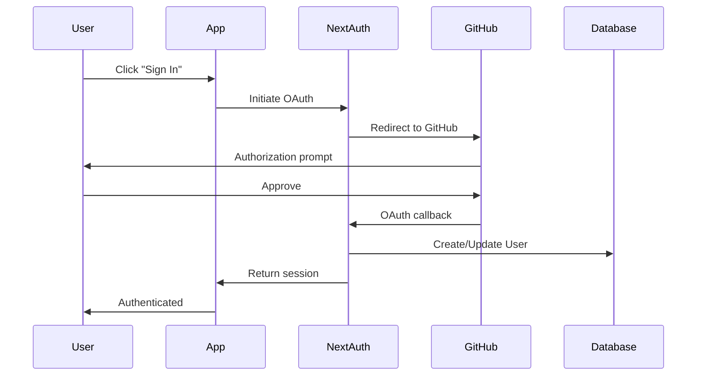

Understand the technical architecture and codebase structure of Repolyze to contribute effectively.

## Tech Stack

<CardGroup cols={3}>
  <Card title="Framework" icon="react">
    Next.js 16, React 19, TypeScript 5
  </Card>
  <Card title="Styling" icon="palette">
    Tailwind CSS 4, shadcn/ui
  </Card>
  <Card title="Data" icon="database">
    Prisma, PostgreSQL
  </Card>
  <Card title="Animation" icon="wand-magic-sparkles">
    Framer Motion, GSAP
  </Card>
  <Card title="AI" icon="brain">
    OpenRouter, AI SDK
  </Card>
  <Card title="Deployment" icon="rocket">
    Vercel
  </Card>
</CardGroup>

### Key Dependencies

```json package.json
{
  "dependencies": {
    "next": "16.1.0",
    "react": "19.2.3",
    "@prisma/client": "^7.4.1",
    "@openrouter/ai-sdk-provider": "^1.5.4",
    "ai": "^5.0.115",
    "framer-motion": "^12.23.26",
    "mermaid": "^11.12.2",
    "jspdf": "^3.0.4",
    "next-auth": "5.0.0-beta.30",
    "zod": "^4.2.1"
  }
}
```

## Project Structure

```
Repolyze/
├── app/                    # Next.js App Router
│   ├── api/               # API routes
│   │   ├── analyze/       # Main analysis endpoint
│   │   ├── branches/      # Branch fetching
│   │   ├── auth/          # Authentication
│   │   └── polar/         # Payment webhooks
│   ├── [owner]/[repo]/    # Dynamic repo routes
│   ├── share/             # Shareable analysis pages
│   ├── layout.tsx         # Root layout
│   └── page.tsx           # Home page
│
├── components/            # React components
│   ├── ui/               # shadcn/ui primitives
│   ├── repo-analyzer/    # Main analyzer
│   ├── analysis-header/  # Results header
│   ├── file-tree/        # File tree viewer
│   ├── share-card/       # Social share cards
│   └── share-modal/      # Export & share modal
│
├── context/              # React Context providers
│   ├── analysis-context.tsx  # Analysis state
│   └── theme-provider.tsx    # Dark/light theme
│
├── hooks/                # Custom React hooks
│   └── use-analysis.ts   # Analysis hook
│
├── lib/                  # Utilities
│   ├── github.ts         # GitHub API wrapper
│   ├── pdf-export.ts     # PDF generation
│   ├── share.ts          # Share utilities
│   ├── storage.ts        # LocalStorage helpers
│   ├── validators.ts     # Input validation
│   ├── auth.ts           # NextAuth config
│   ├── prisma.ts         # Prisma client
│   └── server-cache.ts   # Server-side caching
│
├── prisma/               # Database schema
│   └── schema.prisma
│
├── public/               # Static assets
│   ├── icon.svg
│   └── og-image.png
│
└── types/                # TypeScript definitions
```

## Architecture Overview

### Data Flow



### Component Interaction Flow

```
┌─────────────────┐     ┌──────────────────┐     ┌─────────────────┐
│  RepoAnalyzer   │────▶│ AnalysisContext  │────▶│   API Routes    │
│   (UI Entry)    │     │  (State Mgmt)    │     │  (/api/analyze) │
└─────────────────┘     └──────────────────┘     └─────────────────┘
         │                       │                        │
         ▼                       ▼                        ▼
┌─────────────────┐     ┌──────────────────┐     ┌─────────────────┐
│  AnalysisHeader │     │   File Tree      │     │  GitHub + AI    │
│  (Actions/Nav)  │     │  (Structure)     │     │  (Data Fetch)   │
└─────────────────┘     └──────────────────┘     └─────────────────┘
         │                       │                        │
         ▼                       ▼                        ▼
┌─────────────────┐     ┌──────────────────┐     ┌─────────────────┐
│   ShareModal    │     │   AI Insights    │     │  Score Cards    │
│  (Export/Share) │     │ (Recommendations)│     │  (Metrics)      │
└─────────────────┘     └──────────────────┘     └─────────────────┘
```

## Core Components

### 1. API Routes (`app/api/`)

The API layer handles all server-side logic.

<Accordion title="/api/analyze - Main Analysis Endpoint">
  **Location:** `app/api/analyze/route.ts`
  
  **Purpose:** Analyzes GitHub repositories using AI
  
  **Key files:**
  - `route.ts` - Main POST handler with streaming
  - `config.ts` - API configuration & OpenRouter setup
  - `types.ts` - Request/Response type definitions
  - `validators.ts` - Input validation with Zod
  - `rate-limit.ts` - Rate limiting middleware
  - `stream-handler.ts` - Server-Sent Events streaming
  - `code-analyzer.ts` - Score calculation logic
  - `automation-generator.ts` - Automation suggestions
  - `refactor-generator.ts` - Refactoring suggestions
  - `prompt-builder.ts` - AI prompt construction
  
  **Request flow:**
  1. Validate input (URL, branch)
  2. Check rate limits (per-minute + daily tier-based)
  3. Check cache for existing results
  4. Fetch repo metadata from GitHub
  5. Fetch file tree and important files
  6. Analyze code metrics (calculate scores)
  7. Stream AI analysis via SSE
  8. Generate automations & refactors
  9. Cache results
  
  **Rate limiting:**
  - Burst: In-memory, per IP, 10 requests/minute
  - Daily: DB-backed, tier-based (1/3/44 per day for anon/free/pro)
  
  **Caching:**
  - Server-side LRU cache (100 entries, 1-hour TTL)
  - Deduplication for in-flight requests
</Accordion>

<Accordion title="/api/branches - Branch Fetching">
  **Location:** `app/api/branches/route.ts`
  
  **Purpose:** Fetches all branches for a repository
  
  **Request:** `GET /api/branches?repo=owner/name`
  
  **Response:**
  ```json
  {
    "success": true,
    "data": {
      "branches": [
        { "name": "main", "protected": true, "default": true },
        { "name": "develop", "protected": false, "default": false }
      ],
      "defaultBranch": "main"
    }
  }
  ```
</Accordion>

<Accordion title="/api/auth - Authentication">
  **Location:** `app/api/auth/[...nextauth]/route.ts`
  
  **Purpose:** NextAuth.js authentication with GitHub OAuth
  
  **Features:**
  - GitHub OAuth login
  - Session management
  - User account creation via Prisma
  - Integration with Polar for subscriptions
</Accordion>

### 2. Main Components

<Accordion title="RepoAnalyzer - Main Entry Point">
  **Location:** `components/repo-analyzer/index.tsx`
  
  **Purpose:** Orchestrates the entire analysis UI
  
  **Key features:**
  - URL input with validation
  - Branch selection
  - Analysis state management via `useAnalysis` hook
  - Tab-based navigation (Overview, Architecture, etc.)
  - Loading states and error handling
  - Recent analyses tracking
  
  **Sub-components:**
  - `UrlInput` - Repository URL input
  - `LoadingSkeleton` - Loading state animation
  - `AnalysisHeader` - Results header with actions
  - `ScoreCard` - Score visualization
  - `AIInsights` - AI-generated insights
  - `FileTree` - Repository structure viewer
  - `ArchitectureDiagram` - Architecture visualization
  - `DataFlowDiagram` - Mermaid diagrams
  - `RefactorsPanel` - Refactoring suggestions
  - `AutomationsPanel` - Automation suggestions
</Accordion>

<Accordion title="AnalysisHeader - Results Header">
  **Location:** `components/analysis-header/index.tsx`
  
  **Purpose:** Displays repository metadata and actions
  
  **Features:**
  - Repository name, description, stats
  - Branch selector dropdown
  - Export actions (PDF, Markdown, Plain Text)
  - Share modal trigger
  - Tech stack badges
  - Folder structure overview
  
  **Sub-components:**
  - `branch-selector.tsx` - Branch dropdown
  - `summary-actions.tsx` - Export buttons
  - `tech-badge.tsx` - Technology badges
  - `folder-card.tsx` - Folder stats cards
  - `copy-button.tsx` - Copy to clipboard
</Accordion>

<Accordion title="FileTree - Repository Structure Viewer">
  **Location:** `components/file-tree/index.tsx`
  
  **Purpose:** Interactive file/folder tree visualization
  
  **Features:**
  - Collapsible folders
  - File icons by language
  - Line count & size display
  - Language tags
  - Syntax highlighting indicators
  
  **Files:**
  - `index.tsx` - Main tree container
  - `tree-node.tsx` - Individual nodes (recursive)
  - `file-icon.tsx` - File type icons
  - `language-tags.tsx` - Language badges
  - `types.ts` - Tree data structures
  - `utils.ts` - Tree manipulation utilities
</Accordion>

<Accordion title="ShareModal - Export & Share">
  **Location:** `components/share-modal/index.tsx`
  
  **Purpose:** Export and social sharing functionality
  
  **Features:**
  - Desktop dialog / Mobile drawer (responsive)
  - Download share card as image
  - Copy plain text / Markdown
  - Download PDF report
  - Social media sharing (Twitter, LinkedIn)
  - Copy share URL
  
  **Files:**
  - `index.tsx` - Modal entry point
  - `desktop-dialog.tsx` - Desktop dialog UI
  - `mobile-drawer.tsx` - Mobile drawer UI
  - `action-sections.tsx` - Action buttons
  
  **Share card variants:**
  - Compact - Minimal score display
  - Default - Balanced view
  - Detailed - Full insights
</Accordion>

### 3. Context & State Management

<Accordion title="AnalysisContext - Global Analysis State">
  **Location:** `context/analysis-context.tsx`
  
  **Purpose:** Manages analysis state across the app
  
  **Provides:**
  - `analyze(url)` - Start new analysis
  - `analyzeBranch(branch)` - Analyze different branch
  - `reset()` - Clear current analysis
  - `refresh()` - Force re-analysis
  - `status` - Current state (idle, loading, complete, error)
  - `result` - Analysis results
  - `tier` - User subscription tier
  - `isCached` - Whether result came from cache
  
  **Used by:** All analysis-related components
</Accordion>

<Accordion title="ThemeProvider - Dark/Light Mode">
  **Location:** `context/theme-provider.tsx`
  
  **Purpose:** Manages theme state using next-themes
  
  **Features:**
  - System preference detection
  - Manual theme toggle
  - Persistent theme selection
  - CSS variable updates
</Accordion>

### 4. Utilities (`lib/`)

<Accordion title="github.ts - GitHub API Wrapper">
  **Purpose:** All GitHub API interactions
  
  **Key functions:**
  - `fetchRepoMetadata()` - Get repo info
  - `fetchRepoTree()` - Get file tree
  - `fetchImportantFiles()` - Fetch key files for analysis
  - `fetchRepoBranches()` - List branches
  - `calculateFileStats()` - Calculate metrics
  - `createCompactTreeString()` - Format tree for AI
  
  **Authentication:** Uses `GITHUB_TOKEN` env variable
</Accordion>

<Accordion title="pdf-export.ts - PDF Generation">
  **Purpose:** Generate PDF reports using jsPDF
  
  **Features:**
  - Custom styling with brand colors
  - Multi-page support
  - Embedded charts and diagrams
  - Score visualizations
  - Insights and recommendations
  - File tree rendering
  
  **Usage:**
  ```typescript
  import { generatePDF } from "@/lib/pdf-export";
  
  generatePDF(analysisResult, repositoryMetadata);
  ```
</Accordion>

<Accordion title="storage.ts - LocalStorage Helpers">
  **Purpose:** Client-side caching and persistence
  
  **Features:**
  - Recent analyses tracking (last 10)
  - Cache validation with TTL
  - Type-safe storage operations
  - Automatic cleanup of expired entries
  
  **Functions:**
  - `saveToStorage()` - Save analysis result
  - `getFromStorage()` - Retrieve cached result
  - `getRecentAnalyses()` - Get recent repos
  - `clearStorage()` - Clear all cache
</Accordion>

<Accordion title="server-cache.ts - Server-Side Caching">
  **Purpose:** In-memory LRU cache for API responses
  
  **Configuration:**
  - Max entries: 100
  - TTL: 1 hour (3600s)
  - Size limit: 50MB
  
  **Usage:**
  ```typescript
  import { analysisResultCache } from "@/lib/server-cache";
  
  const cached = analysisResultCache.get(cacheKey);
  if (cached) return cached;
  
  const result = await analyze();
  analysisResultCache.set(cacheKey, result);
  ```
</Accordion>

<Accordion title="validators.ts - Input Validation">
  **Purpose:** Validate user inputs using Zod
  
  **Schemas:**
  - `GitHubUrlSchema` - Validates GitHub URLs
  - `BranchNameSchema` - Validates branch names
  - `AnalyzeRequestSchema` - API request validation
  
  **Functions:**
  - `validateGitHubUrl()` - Parse and validate URL
  - `extractRepoInfo()` - Extract owner/repo from URL
</Accordion>

## Database Schema

<Accordion title="Prisma Schema">
  **Location:** `prisma/schema.prisma`
  
  **Models:**
  
  **User:**
  - Stores authenticated users
  - Links to NextAuth Account/Session
  - Tracks subscription tier
  
  **AnalysisRequest:**
  - Tracks all analysis requests
  - Used for rate limiting
  - Links to User (if authenticated)
  
  **Account / Session:**
  - NextAuth.js OAuth data
  - GitHub account linking
  
  **Example:**
  ```prisma
  model User {
    id            String    @id @default(cuid())
    name          String?
    email         String?   @unique
    image         String?
    tier          String    @default("free")
    polarUserId   String?   @unique
    createdAt     DateTime  @default(now())
    
    accounts      Account[]
    sessions      Session[]
    analyses      AnalysisRequest[]
  }
  
  model AnalysisRequest {
    id          String   @id @default(cuid())
    userId      String?
    ipAddress   String
    repoUrl     String
    createdAt   DateTime @default(now())
    
    user        User?    @relation(fields: [userId], references: [id])
  }
  ```
</Accordion>

## Authentication Flow



## Rate Limiting Strategy

<Accordion title="Burst Rate Limiting (In-Memory)">
  **Location:** `app/api/analyze/rate-limit.ts`
  
  **Limits:**
  - 10 requests per minute per IP
  - Sliding window implementation
  - In-memory Map storage
  
  **Purpose:** Prevent abuse and DDoS
</Accordion>

<Accordion title="Daily Tier-Based Limiting (Database)">
  **Location:** `lib/analysis-rate-limit.ts`
  
  **Limits:**
  - Anonymous: 1 analysis/day
  - Free tier: 3 analyses/day
  - Pro tier: 44 analyses/day
  
  **Implementation:**
  - Counts AnalysisRequest records in last 24h
  - Authenticated users tracked by userId
  - Anonymous users tracked by IP
  - Automatic cleanup of old requests
</Accordion>

## Performance Optimizations

<CardGroup cols={2}>
  <Card title="Server-Side Caching" icon="server">
    LRU cache with 1-hour TTL reduces GitHub API calls
  </Card>
  <Card title="Request Deduplication" icon="link">
    In-flight request tracking prevents duplicate analyses
  </Card>
  <Card title="Streaming Responses" icon="signal-stream">
    SSE streaming shows progress in real-time
  </Card>
  <Card title="Client-Side Cache" icon="database">
    LocalStorage cache for instant re-display
  </Card>
</CardGroup>

## Key Patterns

### 1. Server-Sent Events (SSE) Streaming

The analysis endpoint uses SSE to stream progress updates:

```typescript
// app/api/analyze/stream-handler.ts
export function createAnalysisStream(
  data: AnalysisData,
  cached: boolean
): ReadableStream {
  return new ReadableStream({
    async start(controller) {
      // Send progress updates
      sendEvent(controller, "metadata", data.metadata);
      sendEvent(controller, "fileTree", data.fileTree);
      sendEvent(controller, "scores", data.scores);
      
      // Stream AI insights
      await streamAIInsights(controller, data);
      
      controller.close();
    },
  });
}
```

### 2. Custom Hooks Pattern

The `useAnalysis` hook encapsulates all analysis logic:

```typescript
// hooks/use-analysis.ts
export function useAnalysis() {
  const [status, setStatus] = useState<Status>("idle");
  const [result, setResult] = useState<AnalysisResult | null>(null);
  
  const analyze = async (url: string) => {
    setStatus("loading");
    
    // Fetch with SSE
    const response = await fetch("/api/analyze", { /* ... */ });
    const reader = response.body.getReader();
    
    // Process stream
    while (true) {
      const { done, value } = await reader.read();
      if (done) break;
      
      // Update state with streamed data
      handleStreamEvent(value);
    }
    
    setStatus("complete");
  };
  
  return { analyze, status, result, /* ... */ };
}
```

### 3. Type-Safe API Responses

All API responses use Zod schemas:

```typescript
// app/api/analyze/types.ts
import { z } from "zod";

export const AnalysisResponseSchema = z.object({
  success: z.boolean(),
  cached: z.boolean(),
  data: z.object({
    metadata: RepositoryMetadataSchema,
    scores: ScoreDataSchema,
    insights: z.array(InsightSchema),
    // ...
  }),
});

export type AnalysisResponse = z.infer<typeof AnalysisResponseSchema>;
```

## Testing Approach

While the current codebase doesn't include automated tests, here's the recommended approach for future testing:

<Steps>
  <Step title="Unit Tests">
    - Test utility functions in `lib/`
    - Test validators and schemas
    - Test score calculation logic
  </Step>

  <Step title="Integration Tests">
    - Test API endpoints
    - Test GitHub API wrapper
    - Test authentication flow
  </Step>

  <Step title="Component Tests">
    - Test React components with React Testing Library
    - Test user interactions
    - Test error states
  </Step>

  <Step title="E2E Tests">
    - Test complete analysis flow with Playwright
    - Test branch switching
    - Test export functionality
  </Step>
</Steps>

## Common Tasks

<AccordionGroup>
  <Accordion title="Adding a New Score Metric">
    1. Update the score calculation in `app/api/analyze/code-analyzer.ts`
    2. Add the new score to the `ScoreData` type in `lib/types.ts`
    3. Update the `ScoreCard` component to display it
    4. Update the PDF export to include it
  </Accordion>

  <Accordion title="Adding a New API Endpoint">
    1. Create a new directory in `app/api/`
    2. Add a `route.ts` file with your handler
    3. Define request/response types in `types.ts`
    4. Add validation schemas in `validators.ts`
    5. Test with curl or Postman
  </Accordion>

  <Accordion title="Adding a New UI Component">
    1. Create component file in appropriate `components/` subdirectory
    2. Define prop types interface
    3. Use Tailwind for styling
    4. Import and use in parent component
    5. Add to relevant tab in `RepoAnalyzer`
  </Accordion>

  <Accordion title="Modifying the AI Prompt">
    1. Edit `app/api/analyze/prompt-builder.ts`
    2. Update the `buildPrompt()` function
    3. Test with various repository types
    4. Ensure response format matches expectations
  </Accordion>
</AccordionGroup>

## Further Reading

<CardGroup cols={2}>
  <Card title="Next.js Documentation" icon="book" href="https://nextjs.org/docs">
    Learn about App Router and Server Components
  </Card>
  <Card title="Prisma Documentation" icon="database" href="https://www.prisma.io/docs">
    Database schema and queries
  </Card>
  <Card title="AI SDK Documentation" icon="brain" href="https://sdk.vercel.ai/docs">
    Streaming AI responses
  </Card>
  <Card title="shadcn/ui" icon="palette" href="https://ui.shadcn.com">
    Component library reference
  </Card>
</CardGroup>