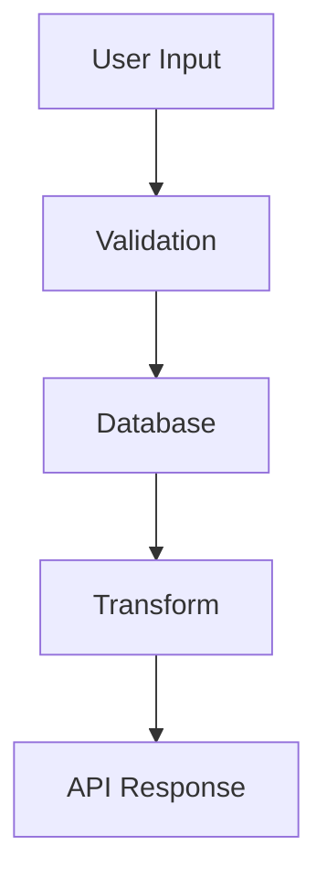

## Overview

Repolyze automatically generates visual diagrams to help you understand system architecture, data flow between components, and dependency relationships. These diagrams are interactive, exportable, and based on actual code analysis.

## Architecture Overview

The architecture diagram organizes components into layers:

### Component Layers

<AccordionGroup>
  <Accordion title="Frontend" icon="desktop">
    Client-side components, UI frameworks, and presentation layer:
    - React/Vue/Angular components
    - Page components and routing
    - UI libraries and design systems
    - Client-side state management
  </Accordion>
  
  <Accordion title="Middleware" icon="filter">
    Request processing, authentication, and intermediate layers:
    - API gateways
    - Authentication/authorization
    - Rate limiting and caching
    - Request transformation
  </Accordion>
  
  <Accordion title="Backend" icon="server">
    Server-side application logic and API endpoints:
    - REST/GraphQL APIs
    - Business logic
    - Controllers and services
    - Application servers
  </Accordion>
  
  <Accordion title="Service" icon="gears">
    Microservices and background workers:
    - Background jobs
    - Message queues
    - Scheduled tasks
    - Service workers
  </Accordion>
  
  <Accordion title="Database" icon="database">
    Data persistence and storage layers:
    - SQL databases (PostgreSQL, MySQL)
    - NoSQL stores (MongoDB, Redis)
    - Object storage (S3)
    - Cache layers
  </Accordion>
  
  <Accordion title="External" icon="cloud">
    Third-party services and integrations:
    - Payment processors (Stripe)
    - Email services (SendGrid)
    - Cloud providers (AWS, Vercel)
    - Analytics services
  </Accordion>
</AccordionGroup>

### Component Cards

Each component displays:

- **Name** - Component identifier
- **Description** - What the component does
- **Technologies** - Frameworks and libraries used (up to 3 shown)
- **Layer indicator** - Visual grouping by architectural layer

<Tip>
Components are automatically detected from package.json, import statements, and configuration files.
</Tip>

## Data Flow Diagram

Visualize how data moves through your system with two view modes:

### Visual View

A structured grid showing:

- **Sources** - Where data originates (user input, APIs, databases)
- **Processes** - How data is transformed (validation, computation, aggregation)
- **Storage** - Where data is persisted (databases, caches, files)
- **Outputs** - Where data is sent (APIs, UI, external services)

**Connections** panel shows data flow relationships:

```
User Input → Validation → Database
Database → Transform → API Response
```

### Diagram View

An interactive Mermaid flowchart that shows:

- **Nodes** - Data flow components with type icons
- **Edges** - Directional arrows showing data movement
- **Labels** - Data type or transformation description
- **Automatic layout** - Clean, organized visualization

<Info>
The diagram is dynamically generated and adapts to your system's complexity.
</Info>

## Diagram Export Options

### PNG Export

Download diagrams as high-resolution images:

1. Click the **PNG** button in the diagram toolbar
2. Image is rendered at 2x scale for clarity
3. Auto-downloads as `data-flow-[timestamp].png`
4. Includes theme-appropriate background

<Note>
PNG exports preserve the current theme (light/dark mode).
</Note>

### Code Export

Copy the Mermaid diagram code:

1. Click the **Code** button
2. Mermaid syntax is copied to clipboard
3. Paste into:
   - README.md files
   - Documentation sites
   - Mermaid Live Editor
   - GitHub markdown

**Example Mermaid code:**



### Fullscreen View

Expand diagrams for detailed inspection:

- Click the maximize icon
- View in large modal window
- All export options available
- Close with ESC key or close button

## Dependency Graph

Understand how components depend on each other:

### Node Types

- **Core modules** - Main application components
- **Shared utilities** - Reusable helpers and functions
- **External packages** - Third-party dependencies
- **Configuration** - Config files and environment setup

### Edge Types

- **Direct dependencies** - Solid lines for explicit imports
- **Indirect dependencies** - Dashed lines for transitive deps
- **Labeled edges** - Show import type or usage context

### Interactive Features

<Steps>
  <Step title="Hover">
    Hover over nodes to see dependency descriptions and metadata.
  </Step>
  
  <Step title="Zoom">
    Use mouse wheel or pinch to zoom in/out on complex graphs.
  </Step>
  
  <Step title="Pan">
    Click and drag to navigate large dependency trees.
  </Step>
  
  <Step title="Focus">
    Click a node to highlight its direct dependencies.
  </Step>
</Steps>

## Theme Support

All diagrams automatically adapt to your theme:

- **Light mode** - Clean white backgrounds, dark text
- **Dark mode** - Dark backgrounds, light text
- **Color consistency** - Matches your site's primary colors

<Tip>
Switch between light and dark mode to find the most readable view for your diagrams.
</Tip>

## Empty States

When diagram data isn't available:

- Clear messaging explaining why
- Icon indicating the missing diagram type
- Graceful fallback (no errors)

Reasons for missing diagrams:

- Repository too small (< 10 files)
- No detectable architecture patterns
- Unsupported language/framework
- Analysis still in progress

## Best Practices

<CardGroup cols={2}>
  <Card title="Export for Documentation" icon="book">
    Copy Mermaid code and include it in your project's README or docs.
  </Card>
  
  <Card title="Share with Team" icon="users">
    Download PNG diagrams to share in Slack, presentations, or wikis.
  </Card>
  
  <Card title="Track Changes" icon="code-compare">
    Re-analyze after refactoring to see architectural improvements.
  </Card>
  
  <Card title="Onboard Developers" icon="user-plus">
    Use diagrams to help new team members understand the codebase.
  </Card>
</CardGroup>

## Next Steps

<CardGroup cols={2}>
  <Card title="Health Scoring" icon="chart-line" href="/features/health-scoring">
    Review quality metrics for your repository
  </Card>
  
  <Card title="Export & Share" icon="share" href="/features/export-share">
    Learn all the ways to share your analysis
  </Card>
</CardGroup>